 
### Linux中安装MariaDB
安装命令

	[root@izwz98uakyyr9xgr2u9ccpz ~]# yum -y install mariadb mariadb -server

安装完成MariaDB,首先启动MariaDB
	
	[root@izwz98uakyyr9xgr2u9ccpz ~]# systemctl start mariadb

设置开机启动

	[root@izwz98uakyyr9xgr2u9ccpz ~]# systemctl enable mariadb

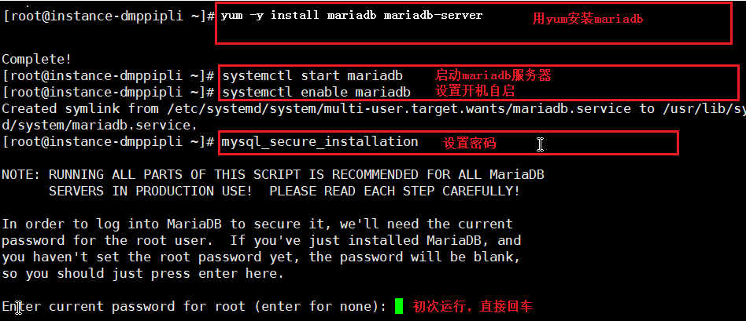

### 设置密码

设置密码命令: mysql_secure_installation

	

	Enter current password for root:<–初次运行直接回车

	a. 设置密码

	Set root password? [Y/n] <– 是否设置root用户密码，输入y并回车或直接回车

	New password: <– 设置root用户的密码
	Re-enter new password: <– 再输入一次你设置的密码

	b. 其他配置

	Remove anonymous users? [Y/n] <– 是否删除匿名用户，回车

	Disallow root login remotely? [Y/n] <–是否禁止root远程登录,回车,

	Remove test database and access to it? [Y/n] <– 是否删除test数据库，回车

	Reload privilege tables now? [Y/n] <– 是否重新加载权限表，回车

	c. 初始化MariaDB完成，接下来测试登录

	mysql -u root -p
	Enter password: 输入密码后会进入到mysql环境
	
	mysql>

### 开启远程连接

　　在本地的mysql数据库中的user表中可以看到默认是只能本地连接的，所有可以添加一个新的用户，该用户可以远程访问

#####1.创建用户

	# 先使用数据库
	mysql> use mysql;

	# 针对ip，如192.168.10.10，‘password’处输密码
	 user 'root'@'192.168.10.10' identified by 'password';

	# ‘%’针对全部，并设置密码
 	create user 'root'@'%' identified by 'password';

##### 2.授权

	# 给用户最大权限
	grant all privileges on *.* to 'root'@'%' identified by 'password';

	# 给部分权限(test 数据库)

	grant all privileges on test.* to 'root'@'%' identified by 'password' with grant option;

	# 刷新权限表
	flush privileges;

	# 查看
	show grants for 'root'@'localhost';

##### 3.本地数据库(Navicat)的一些操作，将本地要部署项目的数据库同步到云服务器，如图所示

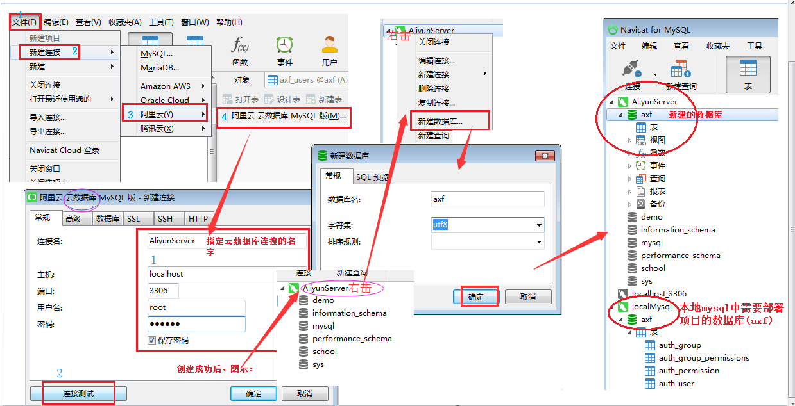

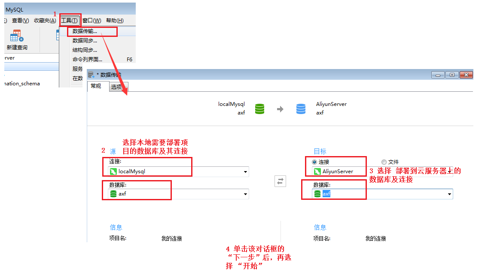

### 安装python3.6

　　在centos中，系统默认只提供python2.7的版本，但是项目我们使用的python3.6的版本。所有我们自己安装python3

#### 安装Python3的方法

1.首先安装依赖包

	yum -y groupinstall "Development tools"

	yum -y install zlib-devel bzip2-devel openssl-devel ncurses-devel sqlite-devel readline-devel tk-devel gdbm-devel db4-devel libpcap-devel xz-devel

2.根据自己需求，下载不同版本的Python3，我下载的是Python3.6.2

	wget https://www.python.org/ftp/python/3.6.2/Python-3.6.2.tar.xz

3.然后解压压缩包，进入该目录，安装Python3

	tar -xvJf  Python-3.6.2.tar.xz
	cd Python-3.6.2
	./configure --prefix=/usr/local/python3
	make && make install

4.创建软链接

	ln -s /usr/local/python3/bin/python3 /usr/bin/python3

	ln -s /usr/local/python3/bin/pip3 /usr/bin/pip3

###安装环境

####0.创建四个文件夹

	命令格式： mkdir 文件夹名   # 多个文件夹用空格隔开
	
	[root@izwz98uakyyr9xgr2u9ccpz ~]# cd /home/
	[root@izwz98uakyyr9xgr2u9ccpz home]# mkdir conf env logs src
	

> 　本案例的配置文件，都习惯将每一个项目的配置文件，日志文件，虚拟环境放在一起，这样开发方便，运维也方便维护。 
> 其中： 
> conf ：是配置文件，用于存放项目的nginx.conf文件，uwsgi.ini文件 
> env ： 是用于存放虚拟环境 
> logs： 是日志文件，用于存放nginx的启动成功和失败文件，以及uwsgi的运行日志文件 
> src ：  是项目文件，该目录下上传的是目录代码。
	

####1.安装virtualenv

	yum install python-virtualenv

####2.创建虚拟环境
	
	cd /home/env/
	virtualenv -p /usr/local/python3/bin/python3 --no-site-packages axfenv

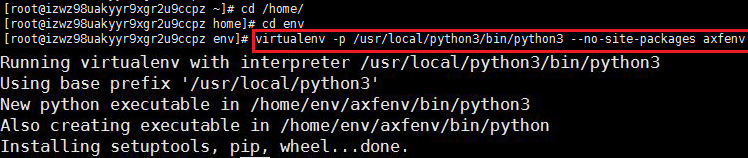

####3.激活虚拟环境, 激活后会进入到(axfenv)虚拟环境中

	source bin/activate

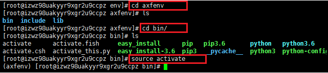

####4. 将部署项目迁移到云服务器（看图）

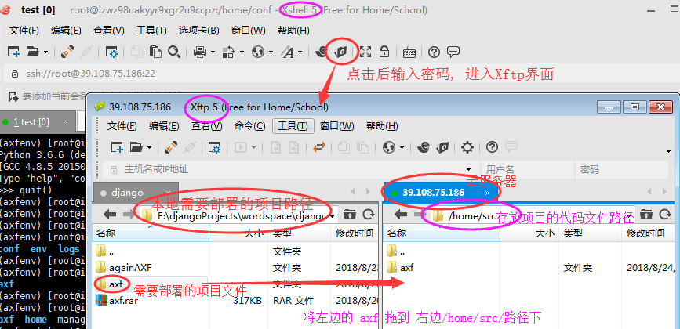

####5.安装环境需要的包
	
	cd /home/src/axf/
	ls 
	pip3 install -r requirement.txt
	
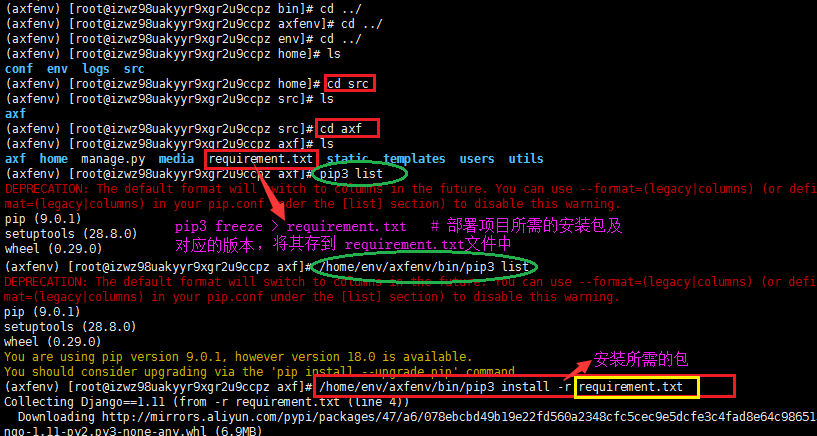

####6. 启动服务器
	
	/home/env/axfenv/bin/python3 manage.py runserver 0.0.0.0:80

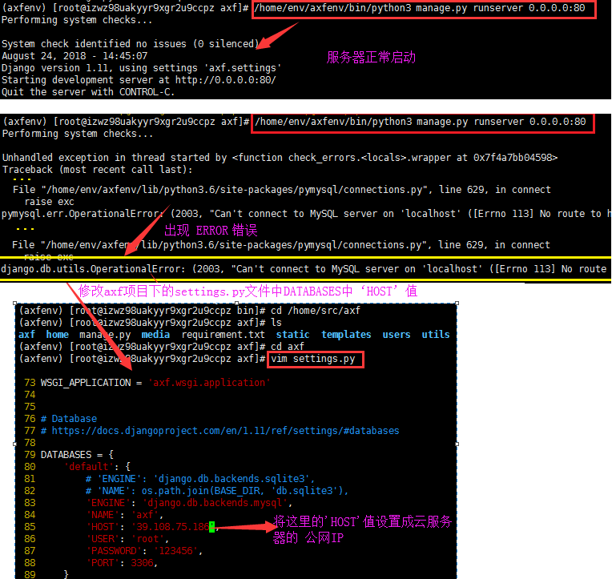

####7.在浏览器中访问ip

### 部署

  该部署采用的是centos7系统来进行。

  配置文件settings.py配置了下面两项：

    DEBUG= False

    ALLOWED_HOSTS = ['*']  #这样可以让所有来源的ip访问到后台

　　使用 python3 manager.py runserver后再去访问，发现没有css,js样式。

　　Django框架仅在开发模式下提供静态文件服务。当我开启DEBUG模式时，Django内置的服务器是提供静态文件的服务的。但是关闭DEBUG模式后，就相当于是生产环境了，Django官网上指出如果是django框架一旦作为生产环境，那么它的静态文件访问接口就不应该从Django框架中走了，应该有独立的web环境，推荐nginx 。

#####1.测试环境中部署方式

<h6>axf/urls.py中的修改</h6>

    修改工程目录下的urls.py

    from django.views.static import serve    # 新增内容

    urlpatterns = [ 
        url(r'^admin/', admin.site.urls),
        url(r'^users/', include('users.urls', namespace='users')),
        url(r'^home/', include('home.urls', namespace='home')),
    	
        # 新增内容
        url(r'^static/(?P<path>.*)$', serve, {"document_root": settings.STATICFILES_DIRS[0]}),
        url(r'^media/(?P<path>.*)$', serve, {"document_root":settings.MEDIA_ROOT}),
    ]

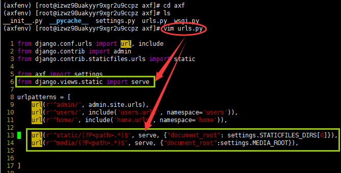

<h6>中间件的修改</h6>

　　如果中间件是过滤哪些地址不需要登录验证的话，可以设置如下的static和media过滤地址的参数：

   
    # 验证用户的登录状态 
    将 '/static/(.*)', '/media/(.*)'这两人路由添加到paths列表中
    paths = ['/user/login/', '/user/register/', '/axf/market/', 
                   '/static/(.*)', '/media/(.*)']

    for path in paths:
        if re.match(path, request.path):
            return None

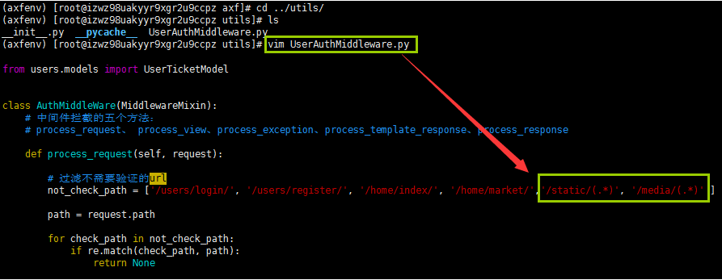

> 这时使用 python3 manager.py runserver后再去访问，发现css,js被成功加载。

#####2.正式环境中部署方式

正式环境中部署为nginx+uwsgi来部署django项目。

**安装nginx**

a）添加nginx存储库

    yum install epel-release

b) 安装nginx

    yum install nginx

c) 运行nginx
    
    systemctl start nginx

> systemctl status nginx   　#　查看nginx的状态  
>  systemctl start nginx 　　＃　启动nginx　 
>  ststemctl retart nginx 　　 #　重启ng
>  inx  
>  systemctl stop nginx　　　＃　关闭或停止nginx  
>  
>  systemctl enable nginx　　＃　设置开机启动  
>  systemctl disable nginx　　＃　禁止开机启动  

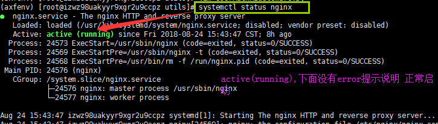

d）如果您正在运行防火墙，请运行以下命令以允许HTTP和HTTPS通信：

    sudo firewall-cmd --permanent --zone=public --add-service=http 

    sudo firewall-cmd --permanent --zone=public --add-service=https

    sudo firewall-cmd --reload

此时再在浏览器中访问，运行结果如下:

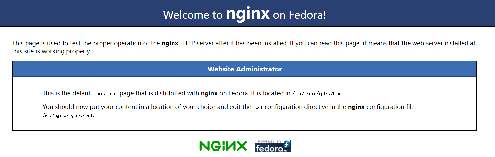

#####3.配置uwsgi

**安装uwsgi**

在虚拟环境中安装uwsgi，假设虚拟环境安装在/home/env/axfenv中

    /home/env/axfenv/bin/pip3 install uwsgi

#####4.配置项目代码，配置项目nginx，配置uwsgi.ini等

**4.1 配置nginx.conf文件**

**首先：**编写自己项目的nginx.conf文件如下：

　　关闭DEBUG模式，在nginx中就要单独做访问/static/目录的路由。每一个项目对应都要有一个自己定义的nginx的配置文件，比如爱鲜蜂项目，定义为axfnginx.conf文件。

axfnginx.conf 配置信息如下：

    server{
        listen    80; 
        server_name 39.108.75.186 localhost;
    
        access_log /home/logs/access.log;
        error_log /home/logs/error.log;

        location / { 
            include uwsgi_params;
            uwsgi_pass 127.0.0.1:8890;

        }   

        location /static/ {
            alias /home/src/axf/static/;
            expires 30d;
        }   

        location /media/ {
            alias /home/src/axf/media/;
        }   
    }

**其次：**修改总的nginx的配置文件，让总的nginx文件包含我们自定义的项目的axfnginx.conf文件

总的nginx配置文件在：/etc/nginx/nginx.conf中

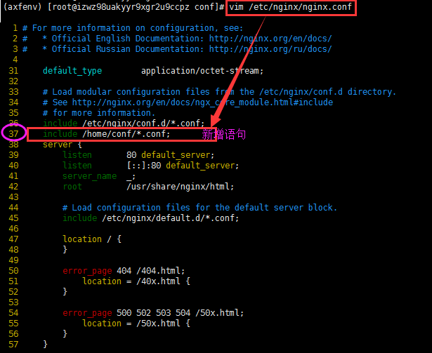

以上步骤操作完成以后，需要重启nginx:

    systemctl restart nginx

如果自定义的axfnginx.conf文件没有错误的话，查看nginx的运行状态会有如下的结果：

<pre>
● nginx.service - The nginx HTTP and reverse proxy server
   Loaded: loaded (/usr/lib/systemd/system/nginx.service; disabled; vendor preset: disabled)
   Active: active (running) since Fri 2018-08-24 15:43:47 CST; 8h ago
  Process: 24573 ExecStart=/usr/sbin/nginx (code=exited, status=0/SUCCESS)
  Process: 24569 ExecStartPre=/usr/sbin/nginx -t (code=exited, status=0/SUCCESS)
  Process: 24568 ExecStartPre=/usr/bin/rm -f /run/nginx.pid (code=exited, status=0/SUCCESS)
 Main PID: 24576 (nginx)
   CGroup: /system.slice/nginx.service
           ├─24576 nginx: master process /usr/sbin/nginx
           └─24577 nginx: worker process
</pre>

**4.2 配置uwsgi文件**

在conf文件夹下除了包含自定义的axfnginx.conf文件，还有我们定义的uwsgi.ini文件( axfuwsgi.ini)

<pre>
[uwsgi]
projectname = axf
base = /home/src

# 守护进程
master = true

# 进程个数
processes = 4

# 虚拟环境
pythonhome = /home/env/axfenv

# 项目地址
chdir = %(base)/%(projectname)

# 指定python版本
pythonpath = /usr/local/python3/bin/python3

# 指定uwsgi文件
module = %(projectname).wsgi

# 和nginx通信地址:端口
socket = 127.0.0.1:8890

# 日志文件地址
logto = /home/logs/uwsgi.log
</pre>

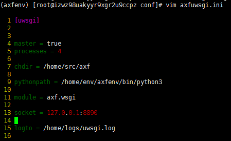

**运行项目**

    /home/env/axfenv/bin/uwsgi --ini axfuwsgi.ini

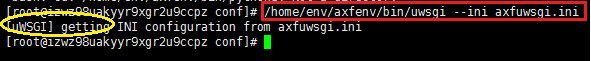

**改进**

1.工程目录下的urls.py中修改
<pre>
    修改工程目录下的urls.py

<s>from django.views.static import serve</s>    # 删除
from home import views

urlpatterns = [ 
    url(r'^admin/', admin.site.urls),
    url(r'^users/', include('users.urls', namespace='users')),
    url(r'^home/', include('home.urls', namespace='home')),
	
    <s>url(r'^static/(?P<path>.*)$', serve, {"document_root": settings.STATICFILES_DIRS[0]}),</s>
    <s>url(r'^media/(?P<path>.*)$', serve, {"document_root":settings.MEDIA_ROOT}),</s>

    # 新增内容
    url(r'^$', views.index)   #  在访问39.108.75.186时，直接访问39.108.75.186/home/index/路由
]

<s> urlpatterns += static(settings.MEDIA_URL, document_root=settings.MEDIA_ROOT)</s>

</pre>

2.中间件的修改

<pre>
将 '/static/(.*)', '/media/(.*)'这两人路由从到paths列表中删除
paths = ['/user/login/', '/user/register/', '/axf/market/', <s>'/static/(.*)', '/media/(.*)'</s>]

# 新增(在访问39.108.75.186时,不能默认访问39.108.75.186/home/index/路由时，增加这个判断)
if request.path == '/':
    return None

for path in paths:
    if re.match(path, request.path):
        return None
</pre>

**访问页面如图所示**

#  flask_deploymentProject

1.在/home目录下创建4个文件夹

    mkdir /home/ conf env logs src

2.创建虚拟环境

    cd /home/env/
    pip install --no-site-packages ajenv

3.激活虚拟环境

    cd /home/env/ajenv/bin/
    source.activate

4.迁移项目

    cd /home/src

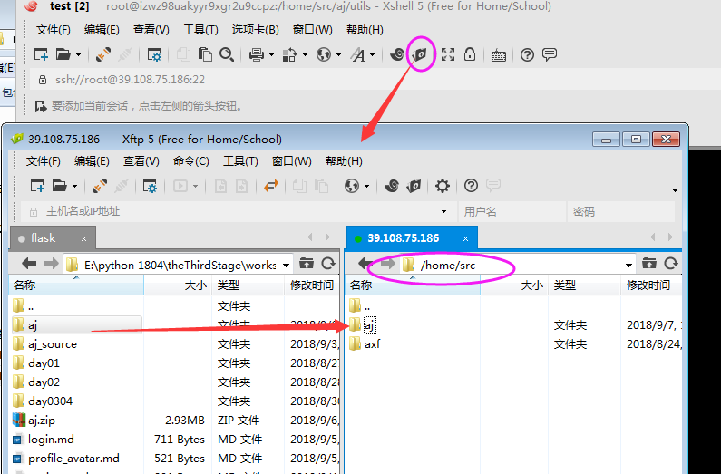

5.安装项目所需的包，requirement.txt

    cd /home/src/aj/
    [root@izwz98uakyyr9xgr2u9ccpz aj]# ls
    [root@izwz98uakyyr9xgr2u9ccpz aj]# /home/env/ajenv/bin/pip3 install -r requirement.txt

6.安装uwsgi

    /home/env/axfenv/bin/pip3 install uwsgi

7.在/home/conf/下创建ajuwsgi.ini 和ajnginx.conf两个文件，并配置

    cd /home/conf/ 
    touch ajuwsgi.ini
    touch ajnginx.conf

7.1 配置ajuwsgi.ini 
   
    cd /home/conf/ 
    vim ajuwsgi.ini

     1 [uwsgi]
     2 master = true
     3 socket = 127.0.0.1:8891
     4 chdir = /home/src/aj
     5 pythonpath = /home/env/ajenv/bin/python3
     6 callable = app
     7 logto = /home/logs/ajuwsgi.log

7.2 配置ajnginx.conf

    vim ajnginx.conf

     1 server{
     2     listen 8080;
     3     server_name 39.108.75.186 localhost;
     4 
     5     access_log /home/logs/ajaccess.log;
     6     error_log /home/logs/error.log;
     7 
     8     location / {
     9         include uwsgi_params;
    10         uwsgi_pass 127.0.0.1:8891;
    11 
    12         uwsgi_param UWSGI_CHDIR /home/src/aj;
    13         uwsgi_param UWSGI_SCRIPT manage:app;
    14     } 
    16 }

8.修改aj项目的settings.py文件

    cd /home/src/aj/utils
    vim settings.py

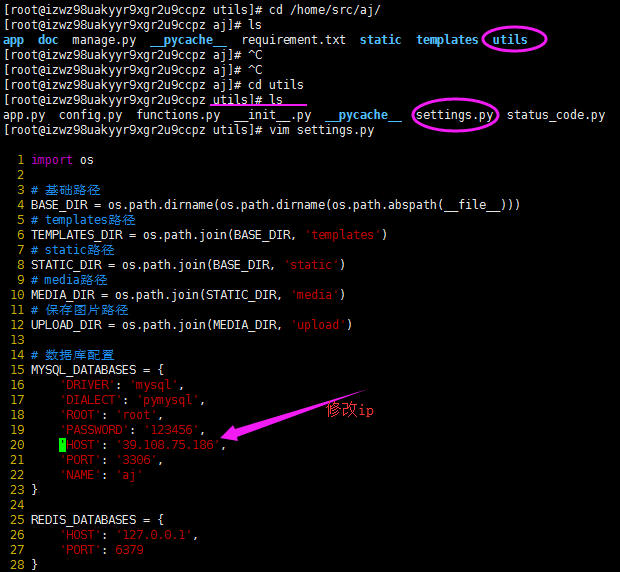

9.修改aj项目的 manage.py文件

    cd/home/src/aj/
    vim manage.py

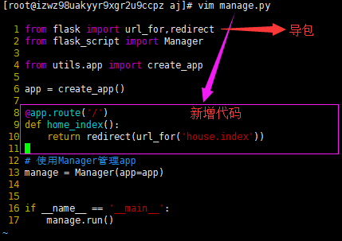

10.迁移本地数据库的数据

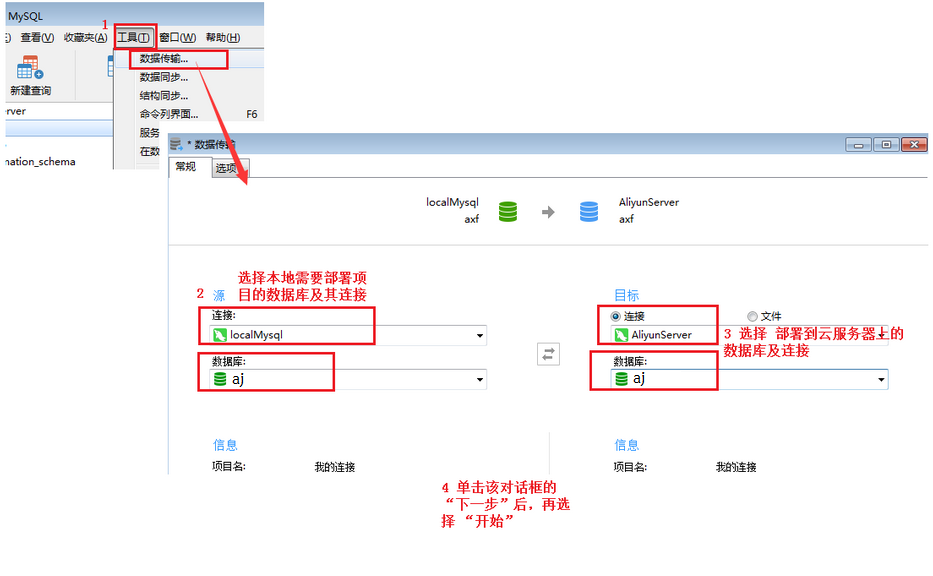

11.启动nginx

    systemctl start nginx

12.启动redis服务器

    redis-server

    启动redis客户端是： redis-cli

13.启动mysql服务器

    systemctl start mysqld

> systemctl restart mysqld  重启  
> systemctl stop mysqld   停止  
> systemctl enable mysqld  开机自启  
> systemctl disable mysqld  取消开机自启  
> 
> 启动mysql客户端:
>  mysql -u root -p

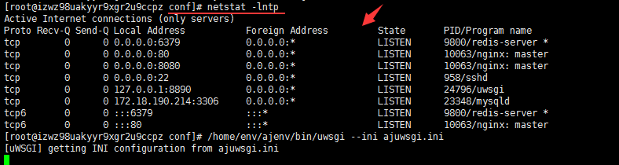

13.启动项目

    第一种
    cd /home/conf/
    [root@izwz98uakyyr9xgr2u9ccpz conf]# /home/env/ajenv/bin/uwsgi --ini ajuwsgi.ini

    第二种
    /home/env/ajenv/bin/python3 manage.py runserver -h 0.0.0.0 -p 8080 -d

在浏览器中访问：39.108.75.186/
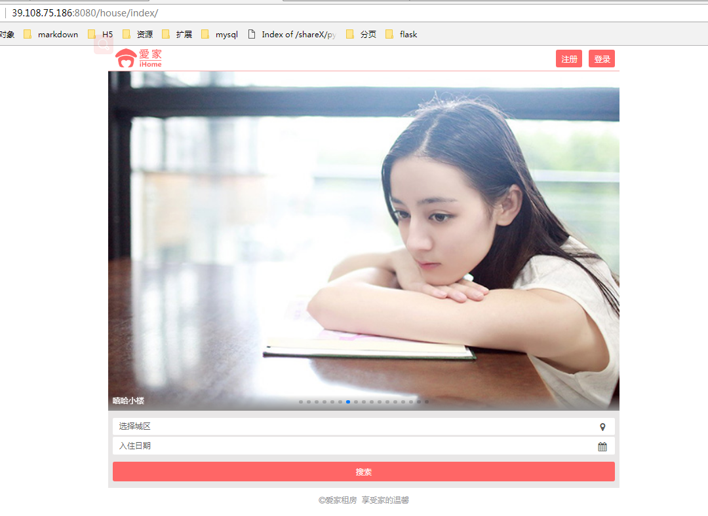

