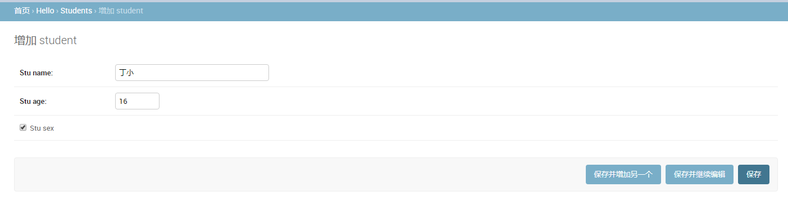

### 前言
　　Djang自身集成了管理后台，在管理后台中可以对我们自定义model进行C（新增）R（查看）U（更新）D（删除）操作，也能进行列表展示解析，分页等。 
#### 使用admin管理后台
 **准备工作，在model中定义Student的模型**

  仍然用前一节创建的day01工程目录下进行下面的操作。

1、如果没有安装MySQL，进入到虚拟环境后，执行“pip install PyMySQL”命令安装，Python 3中使用PyMySQL，Python 2中用MySQLdb。
	
	进入到虚拟环境安装目录下的Scripts文件夹下，按住Shift+右击，选择“在此处打开命令窗口”，然后执行activate.bat进入到虚拟环境

	E:\test\venv\Scripts>activate.bat

	(venv) E:\test\venv\Scripts> pip install PyMySQL

修改 day01/__init__.py文件并加入如下所示的代码，这段代码是如果你使用Python 2版本是不需要加的。在Python 3 中这段代码的作用是将PyMySQL视为MySQLdb来使用，从而避免Django找不到连接MySQL的客户端工具而询问你："Did you install mysqlclient?"(你安装了mysqlclient吗？)

	import pymysql

	pymysql.install_as_MySQLdb()

2、修改项目day01/__setting__.py文件，首先将我们之前创建的应用(hello)添加到已安装的项目中，然后配置MySQL作为持久化方案。
	
	修改__setting__.py文件中的INSTALLED_APPS 、DATABASES部分

	INSTALLED_APPS = [
           'django.contrib.admin',
	    'django.contrib.auth',
	    'django.contrib.contenttypes',
	    'django.contrib.sessions',
	    'django.contrib.messages',
	    'django.contrib.staticfiles',
	    'hrs',
	]

	DATABASES = {
	     'default': {
                'ENGINE': 'django.db.backends.mysql',
                'NAME': 'hello',     # 下面第4步创建数据库时名字要和这里的一样
                'USER': 'root',
                'PASSWORD': '123456',
                'HOST': 'localhost',
                'PORT': 3306

	    }
    }

在__setting__.py文件中DATABASES里的配置ENGINE属性时，常用的可选值包括：

<ul style="list-style-type: circle;   padding-left: 2em;">
<li><code>'django.db.backends.sqlite3'</code> ： SQLite嵌入式数据库。</li>
<li><code>'django.db.backends.postgresql'</code> ：BSD许可证下发行的开源关系型数据库产品。</li>
<li><code>'django.db.backends.mysql'</code> ：转手多次目前属于甲骨文公司的经济高效的数据库产品。</li>
<li><code>'django.db.backends.oracle'</code> ： 甲骨文公司的关系型数据库旗舰产品。</li>
</ul>

NAME属性代表数据库的名称，如果使用SQLite它对应着一个文件，在这种情况下NAME的属性值应该是一个绝对路径；使用其他关系型数据库，则要配置对应的HOST（主机）、PORT（端口）、USER（用户名）、PASSWORD（口令）等属性。

3、启动MySQL数据库服务器

	windows中，通过cmd进入命令提示符窗口中，输入如下命令即可启动mysql服务器:
	net start mysql
	
	linux中，键入以下命令启动mysql服务器:
	sysctl start mysqld

4、创建数据库，数据库名为hello
	
	首先启动MySQL,先进入到MySQL安装目录的bin文件夹中，执行 mysql -h localhost -u root -p，然后输入root用户的密码，进入到mysql命令环境后，执行以下代码，即可创建名为hello的数据库。

	drop database if exists hello;
	create database hello default charset utf8;

5.用PyCharm启动之前创建的项目day01,在hello/models.py中定义Student的模型,代码如下：

    class Student(models.Model):
        stu_name = models.CharField(max_length=10)  
        stu_sex = models.BooleanField()

    class Meta:
        db_table = 'student'

6.在PyCharm下方的Terminal终端执行python manage.py migrate命令来迁移数据库。
    
    (venv) E:\test\workspace\day01> python manage.py migrate

 如果不是第一次进行数据库迁移，则需要执行两条命令才能完成数据库的迁移。代码如下：

    (venv) E:\test\workspace\day01> python manage.py makemigrations
    (venv) E:\test\workspace\day01> python manage.py migrate
  
6'. 在PyCharm中通常我们需要设置一下项目运行的环境。
    
> step1: File -- > Settings;  
> step2: 在弹出的Settings对话框左侧选择：Project:day01--> Project Interpreter后； 
> step3: 然后单击右侧的“设置图标”--> Add Local...  
> step4: 在弹出的Add Local Pytho Interpreter 对话框中选择“Existing environment”选项，点击'' interpreter''右侧的...按钮 
> step5: 选择之前创建虚拟环境的路径下的Scripts文件夹的python.exe。 最后依次单击"ok"按钮即可 

7.在命令终端输入python manage.py runserver

    (venv) E:\test\workspace\day01> python manage.py runserver
    
    按ctrl+c可以退出

8.admin管理后台的url

    查看项目day01/urls路由

    url(r'^admin/', admin.site.urls),

9.在浏览器中输入 http://127.0.0.1:8000/admin/，会弹出Django后台管理 登录界面

10.创建超级管理员账号
    
    在命令终端退出刚才的runserver环境，然后执行：
    (venv) E:\test\workspace\day01> python manage.py createsuperuser

11.重新执行一下上面的第7步和第9步，输入刚才设置的账号密码。

 
12.注册模型类

    在管理后台中操作模型对象。需要在hello的admin.py中写如下代码：
    from django.contrib import admin
    from hello.models import Student

    admin.site.register(Student)  # Student是创建的模型名称

这时刷新浏览器界面，就可以在后台管理系统中看到它们，如图所示

13.对模型进行CRUD操作。

 可以在管理员平台对模型进行C（新增）R（查看）U（更新）D（删除）操作，如下图所示。

添加学生：

查看所有学生

修改或删除学生

13.注册模型管理类 
   继承admin.ModelAdmin, 编写自定义的admin，修改admin.py文件，通过注册模型管理类，可以在后台管理系统中更好的管理模型。
    
    class StudentAdmin(admin.ModelAdmin):
    def set_sex(self):
        if self.stu_sex:
            return '男'
        else:
            return '女'
    set_sex.short_description = '性别'
    list_display = ['id', 'stu_name', set_sex]
    list_filter = ['stu_sex']
    search_fields = ['stu_name']
    list_per_page = 1

    admin.site.register(模型名, StudentAdmin)

> 说明： 
> list\_display: 显示字段  
> list\_filter: 过滤字段    
> search\_fields: 搜索字段  
> list\_per_page: 分页条数  

14、也可以使用装饰器去实现注册

    @admin.register(模型名)
    class StudentAdmin(admin.ModelAdmin):
    def set_sex(self):
        if self.stu_sex:
            return '男'
        else:
            return '女'
    set_sex.short_description = '性别'
    list_display = ['id', 'stu_name', set_sex]
    list_filter = ['stu_sex']
    search_fields = ['stu_name']
    list_per_page = 1

#### 使用ORM完成模型的CRUD操作

在了解了Django提供的模型管理平台之后，我们来看看如何从代码层面完成对模型的CRUD（Create / Read / Update / Delete）操作。我们可以通过manage.py开启Shell交互式环境，然后使用Django内置的ORM框架对模型进行CRUD操作。

    (venv) E:\test\workspace\day01>python manage.py shell
    Python 3.6.4 (v3.6.4:d48eceb, Dec 19 2017, 06:04:45) [MSC v.1900 32 bit (Intel)] on win32
    Type "help", "copyright", "credits" or "license" for more information.
    (InteractiveConsole)
    >>> 

**新增**

    >>> from hello.models import Student
    >>> stu = Student(stu_name='辰月')
    >>> stu.save()
    >>>
    
**更新**

    >>>
    >>> stu.stu_age = 20
    >>> stu.save()

**查询**

查询所有对象

    >>>
    >>> stu.objects.all()
    <QuerySet [<Student: Student object>, <Student: Student object>,<Student: Student object>]>

