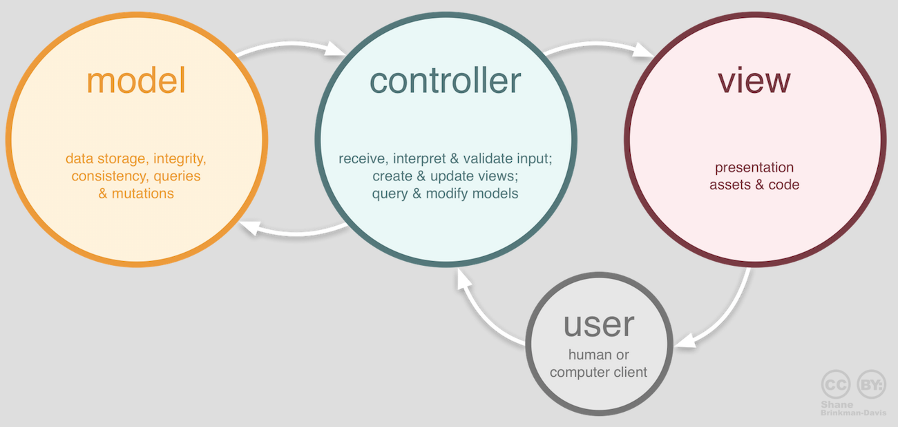
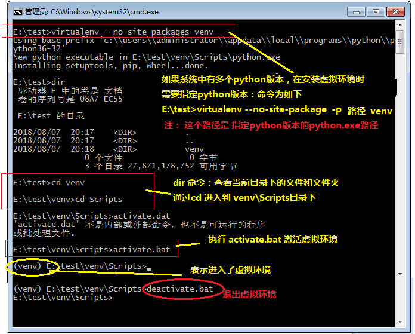

<h1>Django使用指南</h1>
<h3>Django简介</h3>

**Django官网地址** :  [https://www.djangoproject.com/](https://www.djangoproject.com/)

　　Django发布于2005年7月，是当前Python世界里最有名且成熟的网络框架。 最初是被开发用于管理劳伦斯出版集团旗下的以新闻内容为主的网站的，即CMS(内容管理系统)软件。 
　　Django是一个用Python编写的开放源代码的Web应用框架，代码是开源的。此系统采用了MVC的框架模式, 也可以称为MTV模式。
<h3>Django概述</h3>
　　Python的Web框架有上百个，比它的关键字还要多。所谓Web框架，就是用于开发Web服务器端应用的基础设施（通常指封装好的模块和一系列的工具）。通过Web框架，可以化繁为简，同时降低创建、更新、扩展应用程序的工作量。Python的Web框架中比较有名的有：Flask、Django、Tornado、Pyramid、Bottle、Web2py、web.py等。

<h3>MVC框架</h3>
　　MVC全名是Model View Controller，是模型(model)－视图(view)－控制器(controller)的缩写，一种软件设计典范，用一种业务逻辑、数据、界面显示分离的方法组织代码，将业务逻辑聚集到一个部件里面，在改进和个性化定制界面及用户交互的同时，不需要重新编写业务逻辑。MVC被独特的发展起来用于映射传统的输入、处理和输出功能在一个逻辑的图形化用户界面的结构中。

<h3>MVC编程模式</h3>
MVC 是一种使用 MVC（Model View Controller 模型-视图-控制器）设计创建 Web 应用程序的模式：

- Model（模型）表示应用程序核心（比如数据库记录列表）。
- View（视图）显示数据（数据库记录）。
- Controller（控制器）处理输入（写入数据库记录）。

MVC 模式同时提供了对 HTML、CSS 和 JavaScript 的完全控制。 

**Model（模型，数据存取层）** 是应用程序中用于处理应用程序数据逻辑的部分。 
　　通常模型对象负责在数据库中存取数据。 

**View（视图，表示层）** 是应用程序中处理数据显示的部分。渲染html页面给用户，或者返回数据给用户。 
　　通常视图是依据模型数据创建的。 

**Controller（控制器，业务逻辑层）** 是应用程序中处理用户交互的部分。 
　　通常控制器负责从视图读取数据，控制用户输入，并向模型发送数据，进行CRUD(数据的增、删、改、查)操作。 

<h3>框架内容</h3>
　　MVC指MVC模式的某种框架，它强制性的使应用程序的输入、处理和输出分开。使用MVC应用程序被分成三个核心部件：模型、视图、控制器。

　　**优点：**  减低各个模块之间的耦合性，方便变更，更容易重构代码，最大程度的实现了代码的重用。

**框架模式有哪些？**

　　MVC、MTV、MVP、CBD、ORM等

**框架有哪些？**

　　C++语言的QT、MFC、gtk，Java语言的SSH 、SSI，php语言的 smarty(MVC模式)，python语言的django(MTV模式)等

<h3>Django的模式简介</h3>

#### MTV模式

　　严格来说，Django的模式应该是MVT模式，本质上和MVC没什么区别，也是各组件之间为了保持松耦合关系，只是定义上有些许不同。

- Model： 负责业务与数据库(ORM)的对象。  
- View： 负责业务逻辑并适当调用Model和Template。   
- Template: 负责把页面渲染展示给用户。    

>  **注意：**  Django中还有一个url分发器，也叫作路由。主要用于将url请求发送给不同的View处理，View在进行相关的业务逻辑处理。

<h3>Web应用机制和术语</h3>
　　下图向我们展示了Web应用的工作流程，其中涉及到的术语如下表所示。 

<table>
 		<tr>
 			<th>术语</th>
			<th>解释</th>
 		</tr>
 		<tr>
 			<th>URL/URI</th>
 			<td>统一资源定位符/统一资源标识符，网络资源的唯一标识</td>
 		</tr>
 		<tr>
 			<th>域名</th>
 			<td>与Web服务器地址对应的一个易于记忆的字符串名字</td>
 		</tr>
 		<tr>
 			<th>DNS</th>
 			<td>域名解析服务，可以将域名转换成对应的IP地址</td>
 		</tr>
 		<tr>
 			<th>IP地址</th>
 			<td>网络上的主机的身份标识，通过IP地址可以区分不同的主机</td>
 		</tr>
 		<tr>
 			<th>HTTP</th>
 			<td>超文本传输协议，构建在TCP之上的应用级协议，万维网数据通信的基础</td>
 		</tr>
 		<tr>
 			<th>反向代理</th>
 			<td>代理客户端向服务器发出请求，然后将服务器返回的资源返回给客户端</td>
 		</tr>
 		<tr>
 			<th>Web服务器</th>
 			<td>接受HTTP请求，然后返回HTML文件、纯文本文件、图像等资源给请求者</td>
 		</tr>
 		<tr>
 			<th>Nginx</th>
 			<td>高性能的Web服务器，也可以用作反向代理，负载均衡 和 HTTP缓存</td>
 		</tr>
 	</table>

<h3>VIRTUALENV虚拟环境创建指南</h3>
<h4>准备工作</h4>

　　Django版本和Python版本的对应关系，在安装Django时要先检查一下Python版本，再安装对应Django版本。下面是对应关系表
<table>
<tr><th>Django版本	</th><th>Python版本</th></tr>
<tr><td>1.8</td><td>2.7、3.2、3.3、3.4、3.5</td></tr>
<tr><td>1.9、1.10	</td><td>2.7、3.4、3.5</td></tr>
<tr><td>1.11</td><td>2.7、3.4、3.5、3.6</td></tr>
<tr><td>2.0</td><td>3.4、3.5、3.6</td></tr>
</table>

>  在widows下创建虚拟环境用到的是python3.6.4，Django1.11版本的。 
>  在linux下创建虚拟环境用到的是python3.6.4，Django2.0版本的。

**windows下检查python环境和pip环境**

1.检查Python版本：Django 1.11需要Python 2.7或Python 3.4以上的版本；Django 2.0需要Python 3.4以上的版本。 

	Microsoft Windows [版本 6.1.7601]
	版权所有 (c) 2009 Microsoft Corporation。
	保留所有权利。
	C:\Users\Administrator>python
	Python 3.6.4 (v3.6.4:d48eceb, Dec 19 2017, 06:04:45) [MSC v.1900 32 bit (Intel)]	on win32
	Type "help", "copyright", "credits" or "license" for more information.
	>>>

2.输入quit()退出python环境，在cmd能通过pip3启动安装软件

> 说明：在python3.6版本中，python的安装文件夹Script下有pip.exe以及easy_install.exe等可执行文件，就可以使用pip安装

3.如果在python的安装文件夹Script下没有pip.exe，需要输入在cmd中执行以下命令进行安装
	
	python -m ensurepip

<h4>windows中安装使用</h4>

#### 构建虚拟环境

**1.安装virtualenv**

	pip3 install virtualenv

**2.获取帮助**

	virtualenv --help   

	先查看一下安装虚拟环境有哪些参数，是必须填写的。注意两个参数：--no-site-packages和-p python.exe

**3.创建虚拟环境，命名为venv。以及进入和退出venv**

  
> -> 创建：virtualenv --no-site-package venv
> 
> 　　如果系统中有多个python版本，在安装虚拟环境时需要指定python版本： 
> 　　virtualenv --no-site-package  -p C:\Users\Administrator\AppData\Local\Programs\Python\Python36-32\python.exe venv
    

> 
> ->进入/退出 venv
> 
> 　　进入venv\Scripts目录下，执行activate.bat后，在路径前面会出现虚拟环境名(venv) 
> 　　E:\test>cd venv\Scripts  
> 　　E:\test\venv\Scripts>activate.bat 
> 　　(venv) E:\test\venv\Scripts> 
> 
> 　　退出venv ,执行deactivate.bat 
> 　　(venv) E:\test\venv\Scripts>deactivate.bat

#### 搭建Django项目

1.安装Django及所需的数据库PyMySQL

	(venv) E:\test\venv\Scripts> pip install Django==1.11

	(venv) E:\test\venv\Scripts> pip install PyMySQL

2.创建一个Django项目，项目名为day01

	(venv) E:\test\venv\Scripts>django-admin startproject day01

执行上面的命令后看看生成的文件和文件夹，它们的作用如下所示：

　　<code>manage.py </code>:   一个让你用各种方式管理Django项目的命令行工具。

　　<code>day01/__init__.py</code>:   一个空文件，告诉Python这个目录应该被认为是一个Python包。

　　<code>day01/settings.py</code>:  Django项目的配置文件。

　　<code>day01/urls.py</code>:   Django项目的URL声明，就像你网站的“目录”。

　　<code>day01/wsgi.py</code>:  作为你的项目的运行在WSGI兼容的Web服务器上的入口。

3.启动服务器运行项目

	(venv) E:\test\venv\Scripts>cd ../../workspace\day01
	(venv) E:\test\workspace\day01>python manage.py runserver 

	按ctrl+c来终止服务器的运行。

在浏览器中输入 http://127.0.0.1:8000 访问我们的服务器

> 说明：如果执行下面命令
> 
>  python manage.py runserver 端口
>  
> 该命令是运行项目，端口可以不用写，启动的时候会启用默认端口8000；如果指定了端口如8080，那么在浏览器中访问时需要输入：http://127.0.0.1:8080

4.接下来 day01/settings.py 修改该配置文件，Django是一个支持国际化和本地化的框架，因此刚才我们看到的默认首页也是支持国际化的，我们将默认语言修改为中文，时区设置为东八区。

	打开setting.py文件，修改以下2处内容如下：
	# 设置语言代码
	LANGUAGE_CODE = 'zh-hans'
	# 设置时区
	TIME_ZONE = 'Asia/Shanghai'
 

	LANGUAGE_CODE = 'zh-hans' 表示中文， LANGUAGE_CODE = 'en-us' 表示英文。
	TIME_ZONE = 'UTC', UTC是世界标准时间，也就是平常说的零时区。 北京时间表示东八区时间，即UTC+8。

重新执行第3步，刷新浏览器中的页面或重新访问：http://127.0.0.1:8000

5.创建一个名为hello的app(应用)，一个项目可以有多个应用

	(venv) E:\test\workspace\day01>python manage.py startapp hello
执行上面的命令会在当前路径下创建hrs目录，其目录结构如下所示：

6.进入应用目录(hello)修改视图文件views.py

	from django.http import HttpResponse

	def index(request):
	    return HttpResponse('hello, Django!')
7.进入项目day01目录修改urls.py文件

	from django.conf.urls import url
	from django.contrib import admin
	from hello import views   # 增加的

	urlpatterns = [
	    url(r'^admin/', admin.site.urls),
	    # 浏览器访问：127.0.0.1:8000/hello/中的views.index，最后输出hello, Django!
	    url(r'hello/', views.index),   # 增加的
	]
在浏览器中输入：127.0.0.1:8000/hello/，界面呈现如下：

8.优化第7步：如果一个工程项目中有多个应用 ，不建议直接在项目目录下修改urls.py文件，而是在该项目的应用中独立创建一个urls.py文件来单独管理当前应用的url的映射。

	a.) 修改项目day01目录下的urls.py文件，代码如下

	from django.conf.urls import url, include
	from django.contrib import admin

	urlpatterns = [
	    url(r'^admin/', admin.site.urls),
	    url(r'hello/', include('hello.urls'))
	]

	b.) 在hello应用目录下创建一个urls.py空文件，新增内容如下：

	from django.conf.urls import url
	from hello import views

	urlpatterns = [
	    url(r'index/', views.index),
	]

	c.) 在浏览器中输入：127.0.0.1:8000/hello/index/，呈现效果同上。
 

<h4>ubuntu中安装虚拟环境</h4>

**1.安装virtualenv**

	apt-get install python-virtualenv
**2.创建包含python3版本的虚拟环境**

	virtualenv -p /usr/bin/python3 env

	env代表创建的虚拟环境的名称
**3.进入/退出env**

	进入　source env/bin/activate

	退出　deactivate
**4.pip使用**

  &nbsp;&nbsp; 查看虚拟环境下安装的所有的包

   	pip list
&nbsp;&nbsp; 查看虚拟环境通过pip安装的包

	pip freeze
